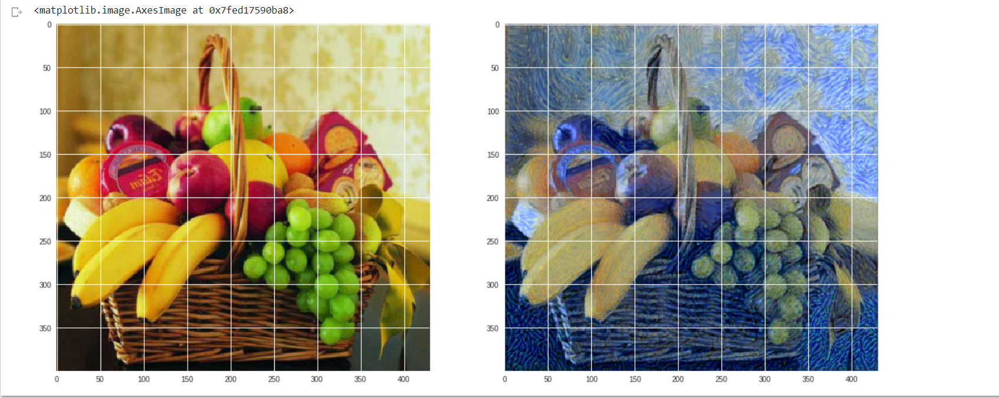

# Style-Transfer
To apply the style of a given image onto another image using pre-trained model.

The Content image is 

The style image is 

The resulting image after running the model is 

View the ipynb at https://colab.research.google.com/drive/1JUZWjdEdMz_BkmQQxTG1BrPZEnGgIGY3  
